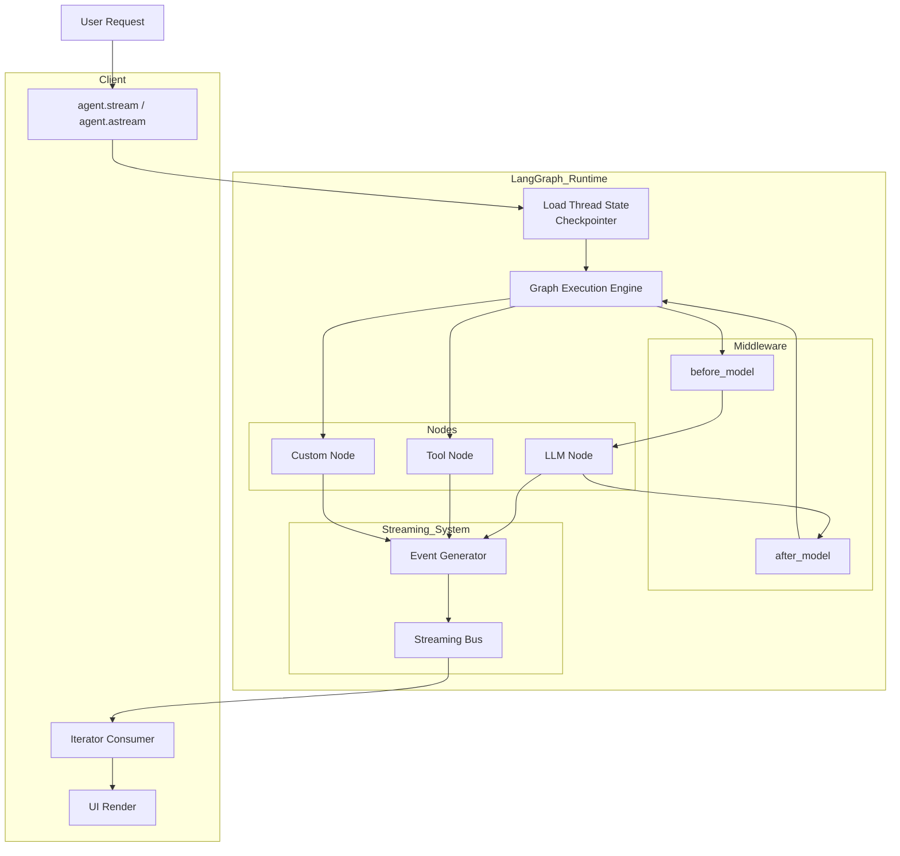

# 实际执行结构
Agent
   ├── Model
   ├── Tools
   ├── Middleware
   └── Runtime
          ├── State
          ├── Context
          ├── Store
          └── StreamWriter

# 解释
Model        → 推理
Tools        → 行动
Middleware   → 控制
Runtime      → 运行环境
State        → 工作记忆
Store        → 长期记忆

# 抽象设计结构
Agent = Model + Tools + Middleware + State
State 指工作状态（working state）

# 什么图？
